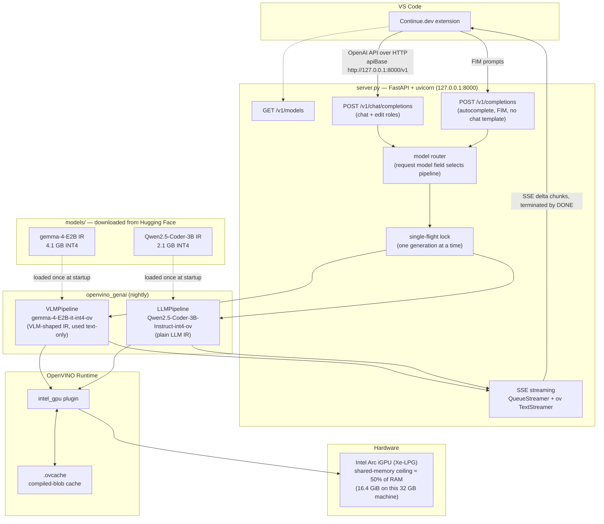

# Architecture

This document explains how the pieces of this project fit together: the FastAPI server, the
OpenVINO GenAI pipelines, the OpenVINO runtime, and the models on disk. For setup and usage see
[README.md](README.md).

## Overview

The system is a local, single-user, OpenAI-compatible inference server. VS Code's Continue.dev
extension talks plain OpenAI HTTP to `server.py`, which forwards generation work to
`openvino_genai` pipelines that execute INT4-quantized models entirely on the Intel Arc iGPU.



## Components

### 1. Continue.dev (client)

Continue is configured with two model entries pointing at the same `apiBase`
(`http://127.0.0.1:8000/v1`, dummy API key):

| Continue role | Model | Endpoint used |
|---|---|---|
| `chat`, `edit` | `gemma-4-E2B-it-int4-ov` | `POST /v1/chat/completions` (streamed) |
| `autocomplete` | `Qwen2.5-Coder-3B-Instruct-int4-ov` | `POST /v1/completions` (FIM) |

Continue formats autocomplete requests as fill-in-the-middle (FIM) prompts using the model's
special tokens (`<|fim_prefix|>`, `<|fim_suffix|>`, `<|fim_middle|>` for Qwen2.5-Coder) and sends
them to the legacy completions endpoint as a raw string prompt.

### 2. `server.py` (API layer)

A deliberately lean FastAPI app (~300 lines, stdlib + `fastapi` + `uvicorn` only):

- **Startup**: reads `MODEL_DIRS` (`;`-separated), loads every model exactly once, keeps them in a
  `dict` keyed by directory name (= the OpenAI model id).
- **Pipeline auto-detect**: a model directory containing `openvino_vision_embeddings_model.xml` is
  a VLM-shaped IR → `VLMPipeline`; otherwise → `LLMPipeline`. This matters because Gemma 4 IRs are
  *always* VLM-shaped (see below), while Qwen IRs are plain LLMs.
- **Routing**: each request's `model` field selects the pipeline; unknown ids get a 404 listing
  what is loaded; a missing field falls back to the first loaded model.
- **Single-flight**: one global `threading.Lock` serializes all generation across all models. The
  iGPU is memory-bandwidth-bound, so concurrent generations would slow each other down more than
  queueing does — and a queue avoids memory blow-ups in the shared-memory budget.
- **Two generation surfaces**:
  - `/v1/chat/completions` maps OpenAI `messages` to an `ov_genai.ChatHistory` (content-part lists
    are flattened to text) and lets the pipeline apply the model's own chat template
    (`chat_template.jinja` shipped inside the IR folder).
  - `/v1/completions` passes the prompt through **raw**, with
    `GenerationConfig.apply_chat_template = False`. This flag defaults to `True` in
    `openvino_genai` and silently wraps even raw strings in the chat template — which breaks FIM.
    Disabling it is what makes autocomplete work.
- **Sampling mapping**: `temperature > 0` → `do_sample=True` (+ `top_p`); otherwise greedy.
  `max_tokens`/`max_completion_tokens` → `max_new_tokens`; `stop` → `stop_strings`.

### 3. Streaming path

OpenVINO GenAI pushes tokens via a streamer callback from inside the (blocking) `generate()` call.
The server bridges that into HTTP SSE:

1. Each streaming request spawns a generation thread that runs `pipe.generate(...)` under the lock.
2. An `ov_genai.TextStreamer` (constructed with the pipeline's tokenizer) receives raw token ids
   and emits **decoded text pieces**. This normalization is required: `VLMPipeline` hands streamers
   token ids while `LLMPipeline` hands subword strings — `TextStreamer` makes both produce text.
3. Decoded pieces go into a thread-safe `queue.Queue`; the FastAPI `StreamingResponse` generator
   drains the queue and yields OpenAI-format SSE chunks (`chat.completion.chunk` deltas or
   `text_completion` chunks), ending with a `finish_reason: stop` chunk and `data: [DONE]`.

### 4. OpenVINO GenAI pipelines (inference layer)

`openvino_genai` (nightly build, pinned in `requirements.txt`) provides the high-level generation
loop: tokenization, KV-cache management, sampling, and detokenization all happen inside the
pipeline in C++ — Python only sees the streamer callbacks.

The two IR shapes in play:

- **Gemma 4 (VLM-shaped IR)** — even for text-only use, the IR is split into
  `openvino_language_model` + `openvino_text_embeddings_model` +
  `openvino_text_embeddings_per_layer_model` (the MatFormer per-layer embeddings, which for E2B is
  *larger* than the language model itself) + `openvino_vision_embeddings_model` (unused here). The
  language model takes 5 inputs, which `LLMPipeline` rejects — `VLMPipeline` is mandatory.
- **Qwen2.5 (plain LLM IR)** — single `openvino_model.xml/.bin` plus tokenizer/detokenizer IRs;
  served by `LLMPipeline`.

Both ship their tokenizer **as OpenVINO IR too** (`openvino_tokenizer.xml`,
`openvino_detokenizer.xml`, via `openvino_tokenizers`), so the whole token-in/token-out loop runs
inside the OpenVINO runtime with no Python/HF-tokenizers dependency at inference time.

### 5. OpenVINO Runtime + Intel GPU plugin (execution layer)

- The pipelines compile their models through `ov.Core` for device **`GPU`** (the Arc iGPU). INT4
  weights are decompressed on the fly by the GPU kernels; activations run in FP16.
- **`CACHE_DIR` (`./.ovcache`)** stores the compiled blobs. First compile of a model costs ~30–70 s;
  every subsequent startup loads the blob in seconds. The cache key includes the device + driver +
  OpenVINO build, so a driver or wheel update transparently triggers recompilation.
- The iGPU has **no dedicated VRAM** — weights, KV-cache, and compile workspace all live in shared
  system RAM, capped by the Windows driver at **≈ 50% of installed RAM**
  (`GPU_DEVICE_TOTAL_MEM_SIZE`; 16.4 GiB on the 32 GB development machine). That cap, not total
  system RAM, is what ruled out the 30B-class MoE models (~14–15 GiB weights + workspace) here.

### 6. Models on disk

`models/` holds OpenVINO IR snapshots downloaded from Hugging Face by
`scripts/download_model.py` (`huggingface_hub.snapshot_download`; authenticated — anonymous XET
transfers of multi-GB files stall). Each folder is self-contained: model IR, tokenizer IR,
`generation_config.json`, and `chat_template.jinja`. The folder name doubles as the served model id.

## Request lifecycles

**Chat** (`stream: true`):

```text
Continue → POST /v1/chat/completions {model, messages, stream:true}
  → router picks VLMPipeline(gemma-4-E2B)
  → messages → ChatHistory → chat template applied in-pipeline
  → generation thread acquires lock, generate() streams token ids
  → TextStreamer decodes → queue → SSE deltas → ... → data: [DONE]
```

**Autocomplete** (FIM):

```text
Continue → POST /v1/completions {model, prompt:"<|fim_prefix|>...<|fim_middle|>"}
  → router picks LLMPipeline(Qwen2.5-Coder-3B)
  → apply_chat_template=False → prompt tokenized raw (FIM specials → special ids)
  → generate() under the same lock → completion text returned (or streamed)
```

## Design constraints that shaped this

| Constraint | Consequence |
|---|---|
| iGPU shares system RAM, capped at ≈ 50% of it by the driver | small INT4 models; single-flight lock; no 30B MoEs on 32 GB RAM |
| Decode is bandwidth-bound (~15 tok/s per ~4 GB of weights) | E2B (4.1 GB → 30 tok/s) for chat, 3B (2.1 GB → 24 tok/s, 0.15 s TTFT) for autocomplete |
| Continue needs OpenAI surface + streaming | exact OpenAI JSON/SSE shapes, `/v1` base path |
| Gemma 4 IR is VLM-shaped | `VLMPipeline` + per-model pipeline auto-detection |
| `apply_chat_template` defaults to `True` | explicitly disabled on `/v1/completions` for FIM |
| Lean-first design goal | no model-server framework; ~300-line FastAPI app, stdlib threading/queue |
